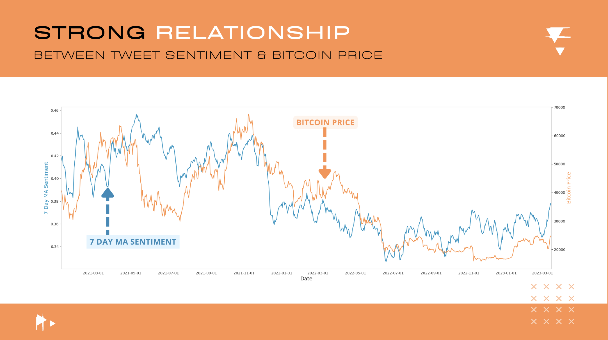
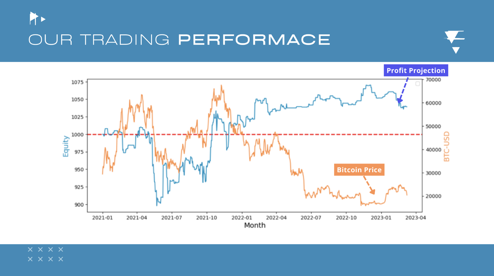
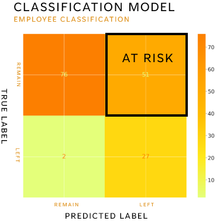

# Hi, I'm Peter Lambert

A Data Scientist from England, based in London. I'm currently working on a range of projects which I'd love to talk about.

🦫 Examples of my work: [Data Analysis](https://github.com/PeterLambertGitt/employee_churn/blob/master/data_analysis/data_analysis.ipynb), [Data Visualisation](https://www.canva.com/design/DAFdUCdcSRI/g_YhFyK26dEKrt5J0LeU0w/view#1), [Presentations](https://github.com/PeterLambertGitt/employee_churn/blob/master/powerpoint_presentation/high_performance_employee_churn_presentation.pptx), [Production Code](https://github.com/PeterLambertGitt/crypto_2/tree/main/master_code), 
[Data Pipelines](https://github.com/PeterLambertGitt/crypto_2/blob/main/master_code/live_updating_master.py),
[Logistic Regression](https://github.com/PeterLambertGitt/employee_churn/blob/master/modelling/logistic_regression.ipynb)

🔭 Projects of mine: 

 ## 
<strong> [Crypto Sentiment Analysis](https://github.com/PeterLambertGitt/crypto_2) </strong>

### 
 Modelling twitter sentiment using NLP and Deep Learning to inform crypto trading strategies 

Skills used: Data Pipelines, NLP, Deep Learning, Trading Strategies, Python, APIs, Production Code, Code Packaging 

Sentiment to price relationship|  Trading strategy profit          |  Project workflow and data pipeline            
:-------------------------:|:-------------------------:|:-------------------------:
  |  |  

## 
<strong> [Employee Churn Analysis](https://github.com/PeterLambertGitt/employee_churn) </strong>

### 
 Analysing employee data to improve high-performing employee retention. 

 Skills used: Pandas, Seaborn, Juypter Notebooks, Logistic Regression, Data Visualisation 

Analysis of leavers by age category|  Analysis of job satisfaction over time          |  Analysis of Logistic Regression Coefficients |  Logistic Regression Classification                    
:-------------------------:|:-------------------------:|:-------------------------:|:-------------------------:
  |  |  |   

## 
<strong> [Customer Segmentation](https://github.com/PeterLambertGitt/customer_segmentation) </strong>

### 
 Using various modelling techniques to segment customers for applications such as marketing campaigns and increased engagement. 

 Skills used: K-Means Clustering, RFM Analysis, Pandas, Seaborn, Juypter Notebooks, MatPlotLib 

RFM Clustering |  K-Means Clustering Visualisation          | K-Means Clustering Visualisation                 
:-------------------------:|:-------------------------:|:-------------------------:
  |  |  

🌱 I’m currently learning:
- <strong> R: Statistical Analysis </strong>
- <strong> Microsoft Power BI: Data Visualisation </strong>
- <strong> Docker: Containerized Application Development </strong>
 
💬 Ask me about:
# 🤖 CryptoBot!

## 📫 How to reach me: ...

## Tools

     

## Tech stack
    

## Stats

<!--
**PeterLambertGitt/my-profile** is a ✨ _special_ ✨ repository because its `README.md` (this file) appears on your GitHub profile.

Here are some ideas to get you started:

-->
